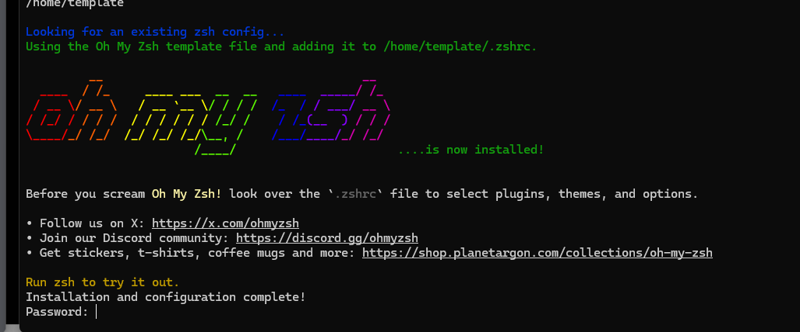

# shellconfig
public shell scripts for init themes, etc.


# debian-shellinit.sh

This script should be executed without Sudo, but passwords will have to be provided for sudo executions and chsh within the script.

1. grab the raw file

    ```
    curl https://raw.githubusercontent.com/mackling101/shellconfig/refs/heads/main/debian-shellinit.sh -O
    ```

1. make the raw .sh executable

    ```
    sudo chmod +x debian-shellinit.sh
    ```

1. execute the .sh

    ```
    ./debian-shellinit.sh
    ```

1. Enter your passwords as needed.

    Password should be the password of the user.

    

1. Restart / Reconnect your shell!

    You can restart your shell with `Ctrl+d` command. If you are SSH, you will need to reconnect. Establishing the new connection should have the zsh as the default shell now.